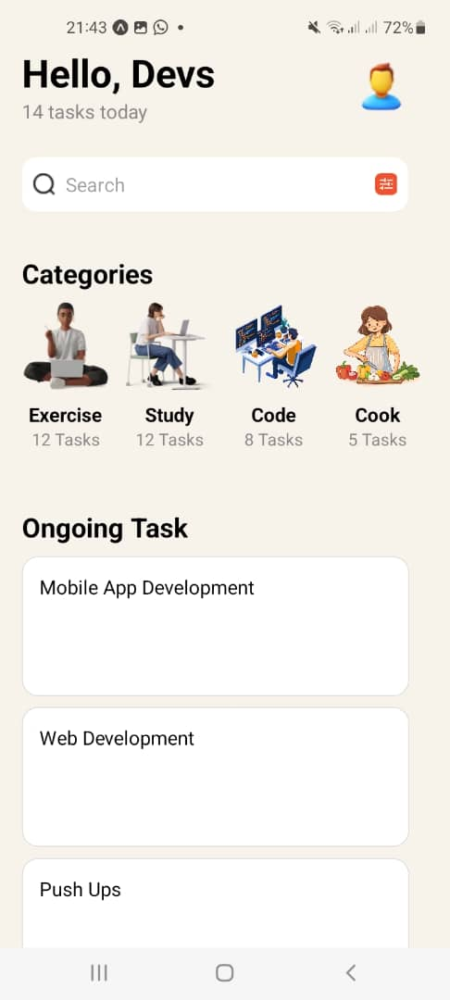

# React Native Task Management App

This React Native application provides a task management interface with categorized tasks and ongoing tasks, designed to closely match a provided UI mockup.

## Components

### App Component

The main component that renders the overall layout of the application, including the header, search bar, categories, and ongoing tasks.

### Categories Section

- **CategoryItem**: Custom component that displays an individual category with an image, title, and task count.

### Ongoing Tasks Section

- **TaskItem**: Custom component that displays an ongoing task.

### Other Core Components

- **ScrollView**: Used for the main layout to enable vertical scrolling.
- **TextInput**: Used for the search bar to allow users to search for tasks.
- **FlatList**: Used for rendering the list of categories horizontally.
- **Image**: Used for displaying icons and images in the header, search bar, categories, and tasks.
- **Text**: Used for all textual content in the application.
- **View**: Used for layout and structuring the components.

## Screenshots

